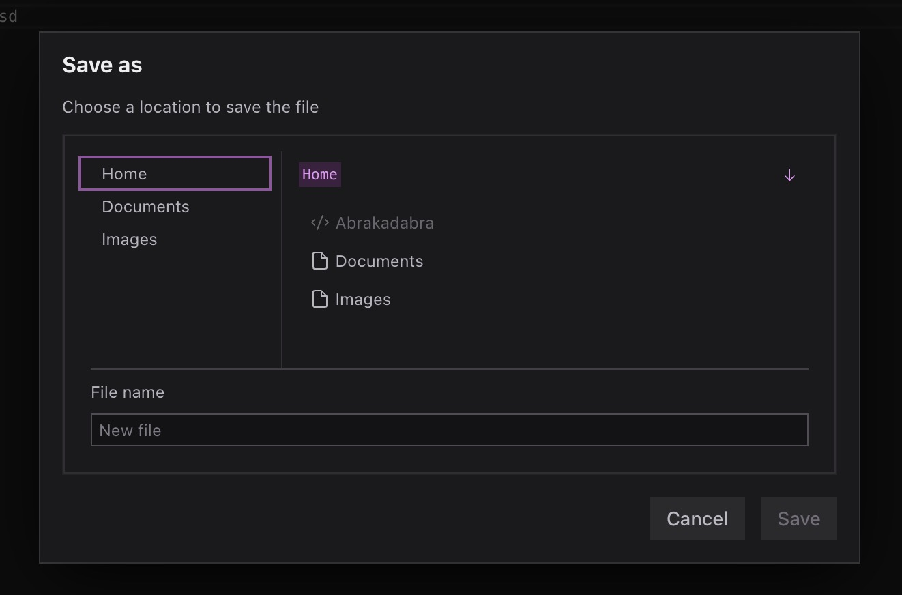

# Components

Radix OS exports some helper components for use in the operating system.

## `SaveAsDialog`

A dialog that lets a user choose a path and filename.

```typescript
type SaveAsDialogProps = {
  open: boolean;
  setOpen: (open: boolean) => void;
  onPathCreate: (path: string) => Promise<void>;
};
```



## `OpenFileDialog`

A dialog that lets a user open a file

```typescript
type SaveAsDialogProps = {
  open: boolean;
  setOpen: (open: boolean) => void;
  onFileOpened: (file: FsFile, path: string) => void;
  /** Determine if given file should be disabled */
  fileDisabled?: (file: FsFile) => boolean;
};
```


## `Explorer`

The raw underlying version of the Explorer application, without the application window. Used internally in `OpenFileDialog` and `SaveAsDialog`.

```tsx
type ExplorerProps = {
  initialPath?: string;
  windowId?: symbol;
  onPathChange?: (path: string) => void;
  disableFiles?: boolean;
  fileDisabled?: (file: FsFile) => boolean;
  onRequestOpenFile?: (file: FsFile, path: string) => void;
};
```
